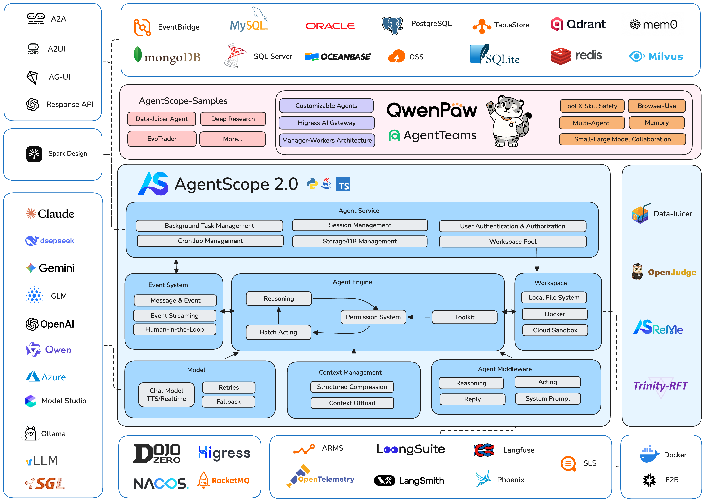

<p align="center">
  
</p>

<span align="center">

[**中文主页**](https://github.com/agentscope-ai/agentscope/blob/main/README_zh.md) | [**Documentation**](https://docs.agentscope.io/) | [**Roadmap**](https://github.com/orgs/agentscope-ai/projects/2/views/1)

</span>

<p align="center">
    <a href="https://arxiv.org/abs/2402.14034">
        
    </a>
    <a href="https://pypi.org/project/agentscope/">
        
    </a>
    <a href="https://pypi.org/project/agentscope/">
        
    </a>
    <a href="https://discord.gg/eYMpfnkG8h">
        
    </a>
    <a href="https://docs.agentscope.io/">
        
    </a>
    <a href="./LICENSE">
        
    </a>
    <a href="https://deepwiki.com/agentscope-ai/agentscope">
        
    </a>
</p>

<p align="center">

</p>

## What is AgentScope 2.0?

AgentScope 2.0 is a production-ready, easy-to-use agent framework with essential abstractions that keep up with rising model capability.

We design for increasingly agentic LLMs.
Our approach leverages the models' reasoning and tool use abilities
rather than constraining them with strict prompts and opinionated orchestrations.



## News
<!-- BEGIN NEWS -->
- **[2026-08] `FEAT`:** Console supported — test and debug agents in the terminal. [Example](https://github.com/agentscope-ai/agentscope/tree/main/examples/console) | [Docs](https://docs.agentscope.io/latest/en/building-blocks/console)
- **[2026-08] `INTE`:** Feishu (Lark) and Discord channels supported. [Feishu](https://docs.agentscope.io/latest/en/deploy/channel/feishu) | [Discord](https://docs.agentscope.io/latest/en/deploy/channel/discord)
- **[2026-08] `FEAT`:** Channels supported — connect agents to IM platforms in agent service. [Example](https://github.com/agentscope-ai/agentscope/tree/main/examples/agent_service) | [Docs](https://docs.agentscope.io/latest/en/deploy/channel/overview)
- **[2026-08] `INTE`:** GitHub MCP Registry and ClawHub supported as built-in hubs. [Example](https://github.com/agentscope-ai/agentscope/tree/main/examples/agent_service) | [Docs](https://docs.agentscope.io/latest/en/deploy/hub)
- **[2026-08] `FEAT`:** MCP & Skill Hub supported — browse a hub, install into your library, add to a workspace. [Example](https://github.com/agentscope-ai/agentscope/tree/main/examples/agent_service) | [Docs](https://docs.agentscope.io/latest/en/deploy/hub)
- **[2026-07] `INTE`:** Daytona-based workspace/sandbox supported. [Docs](https://docs.agentscope.io/latest/en/building-blocks/workspace)
- **[2026-07] `INTE`:** K8s, OpenSandbox-based workspace/sandbox supported. [Docs](https://docs.agentscope.io/latest/en/building-blocks/workspace)
- **[2026-07] `INTE`:** ReMe long-term memory supported. [Example](https://github.com/agentscope-ai/agentscope/tree/main/examples/long_term_memory/reme) | [Docs](https://docs.agentscope.io/latest/en/building-blocks/long-term-memory)
- **[2026-06] `FEAT`:** Agentic Memory supported. [Example](https://github.com/agentscope-ai/agentscope/tree/main/examples/long_term_memory/agentic_memory) | [Docs](https://docs.agentscope.io/latest/en/building-blocks/long-term-memory)
- **[2026-06] `FEAT`:** Distributed & Multi-Tenancy & Multi-Session RAG service supported. [Docs](https://docs.agentscope.io/latest/en/deploy/agent-team)
<!-- END NEWS -->

[More news →](./docs/NEWS.md)

## Community

Welcome to join our community on

| [Discord](https://discord.gg/eYMpfnkG8h)                                                                                         | DingTalk                                                                  |
|----------------------------------------------------------------------------------------------------------------------------------|---------------------------------------------------------------------------|
|  |  |

## Quickstart

### Installation

> AgentScope requires **Python 3.11** or higher.

#### From PyPI

```bash
uv pip install agentscope
```

#### From source

```bash
# Pull the source code from GitHub
git clone -b main https://github.com/agentscope-ai/agentscope.git

# Install the package in editable mode
cd agentscope

uv pip install -e .
```

## Agent

The SDK layer — compose an agent from a rich set of building blocks:

| Building block | What's inside |
|---|---|
| [**ReAct**](https://docs.agentscope.io/latest/en/building-blocks/agent/overview) | Reasoning-acting loop with structured output, realtime interruption & resume, and batched (sequential / concurrent) tool acting |
| [**Toolkit**](https://docs.agentscope.io/latest/en/building-blocks/tool/overview) | Agentic tool management over Python tools, MCP servers, and skills; ships with built-in coding tools (shell, file edit, search) and task/plan tools |
| [**Model**](https://docs.agentscope.io/latest/en/building-blocks/model/overview) | LLM, embedding, and TTS across major providers (OpenAI, Anthropic, Gemini, DashScope, DeepSeek, Moonshot, xAI, Ollama) |
| [**Context**](https://docs.agentscope.io/latest/en/building-blocks/context/overview) | Automatic compaction, tool-result offload, and context injection (system prompt, RAG, memory) via built-in middleware |
| [**Event System**](https://docs.agentscope.io/latest/en/building-blocks/message-and-event) | Unified event bus streaming reasoning, tool calls, and multimodal content (text, image, audio) to the frontend |
| [**Permission & HITL**](https://docs.agentscope.io/latest/en/building-blocks/permission-system/overview) | Fine-grained control over tools and resources, confirmation, bypass mode |
| [**Middleware**](https://docs.agentscope.io/latest/en/building-blocks/middleware) | Composable hooks across the loop — reply, reasoning, acting, model calling, permission checking, context compression, system prompt |
| [**Memory**](https://docs.agentscope.io/latest/en/building-blocks/long-term-memory) | Agentic memory with switchable backends (ReMe, Mem0) |
| [**Workspace / Sandbox**](https://docs.agentscope.io/latest/en/building-blocks/workspace/overview) | Isolated tool & code execution — local, Docker, Apple Container, Bubblewrap, E2B, OpenSandbox, Daytona, K8s |

Start your first agent with AgentScope 2.0 in console:

```python
from agentscope.agent import Agent
from agentscope.console import launch_console
from agentscope.tool import Toolkit, Bash, Grep, Glob, Read, Write, Edit
from agentscope.credential import DashScopeCredential
from agentscope.model import DashScopeChatModel

import os, asyncio


async def main() -> None:
    agent = Agent(
        name="Friday",
        system_prompt="You're a helpful assistant named Friday.",
        model=DashScopeChatModel(
            credential=DashScopeCredential(
              api_key=os.environ["DASHSCOPE_API_KEY"]
            ),
            model="qwen3.6-plus",
        ),
        toolkit=Toolkit(
            tools=[
                Bash(),
                Grep(),
                Glob(),
                Read(),
                Write(),
                Edit(),
            ]
        ),
    )

    # Chat with the agent in the terminal — streamed output, tool-call
    # confirmation and Ctrl+C interruption are all handled for you
    await launch_console(agent)

asyncio.run(main())
```

## Agent Service — All You Need to Build Your App

AgentScope ships a batteries-included **agent service** — a FastAPI backend with a pre-built Web UI (`examples/web_ui`) that turns your agents into a multi-tenant, multi-session application, with rich capabilities out of the box:

| Capability | What you get |
|---|---|
| [**Serving**](https://docs.agentscope.io/latest/en/deploy/agent-service) | Multi-tenancy, multi-session isolation, FastAPI backend, pre-built Web UI |
| [**Agent Team**](https://docs.agentscope.io/latest/en/deploy/agent-team) | Leader–worker orchestration, built-in team tools, task planning |
| [**Channels**](https://docs.agentscope.io/latest/en/deploy/channel/overview) | Connect agents to IM platforms — Feishu (Lark), Discord, custom channels, message routing |
| [**RAG Service**](https://docs.agentscope.io/latest/en/deploy/rag) | Blob storage, index worker, multi-tenant retrieval |
| [**MCP & Skill Hub**](https://docs.agentscope.io/latest/en/deploy/hub/overview) | Browse hubs (GitHub MCP Registry, ClawHub), install into your library, add to a workspace |
| [**Resource Sharing**](https://docs.agentscope.io/latest/en/deploy/sharing) | Group- and org-level management for sharing models, MCP servers, skills, and workspaces |
| [**Persistence**](https://docs.agentscope.io/latest/en/deploy/agent-service#storage-backend) | SQL & NoSQL persistence of agent state and sessions |
| [**Scheduling**](https://docs.agentscope.io/latest/en/deploy/agent-service) | Scheduled tasks, agent wakeup, background task offloading |

Everything above is composable, so you can assemble your own application on top of the service with minimal glue code.

<table>
  <tr>
    <td align="center">
      
      <br/>
      <sub><b>Agent team</b> — a leader agent spawns workers and coordinates them through the built-in team tools.</sub>
    </td>
  </tr>
  <tr>
    <td align="center">
      
      <br/>
      <sub><b>Task planning</b> — the agent breaks complex work into a tracked plan and updates it as it goes.</sub>
    </td>
  </tr>
  <tr>
    <td align="center">
      
      <br/>
      <sub><b>Permission control in bypass mode</b> — the agent runs end-to-end without pausing for tool-call confirmations.</sub>
    </td>
  </tr>
  <tr>
    <td align="center">
      
      <br/>
      <sub><b>Background task offloading</b> — a long-running tool moves to the background; its result later wakes the agent up and the conversation resumes.</sub>
    </td>
  </tr>
</table>

Run the following commands to start the agent service backend and the web UI:

```bash
git clone -b main https://github.com/agentscope-ai/agentscope.git
cd agentscope/examples/agent_service

# start the agent service backend
python main.py
```

Then open another terminal to start the web UI:

```bash
cd agentscope/examples/web_ui

# start the webui
pnpm install
pnpm dev
```


## Contributing

We welcome contributions from the community! Please refer to our [CONTRIBUTING.md](./CONTRIBUTING.md) for guidelines
on how to contribute.

## License

AgentScope is released under Apache License 2.0.

## Publications

If you find our work helpful for your research or application, please cite our papers.

- [AgentScope 1.0: A Developer-Centric Framework for Building Agentic Applications](https://arxiv.org/abs/2508.16279)

- [AgentScope: A Flexible yet Robust Multi-Agent Platform](https://arxiv.org/abs/2402.14034)

```
@article{agentscope_v1,
    author  = {Dawei Gao, Zitao Li, Yuexiang Xie, Weirui Kuang, Liuyi Yao, Bingchen Qian, Zhijian Ma, Yue Cui, Haohao Luo, Shen Li, Lu Yi, Yi Yu, Shiqi He, Zhiling Luo, Wenmeng Zhou, Zhicheng Zhang, Xuguang He, Ziqian Chen, Weikai Liao, Farruh Isakulovich Kushnazarov, Yaliang Li, Bolin Ding, Jingren Zhou}
    title   = {AgentScope 1.0: A Developer-Centric Framework for Building Agentic Applications},
    journal = {CoRR},
    volume  = {abs/2508.16279},
    year    = {2025},
}

@article{agentscope,
    author  = {Dawei Gao, Zitao Li, Xuchen Pan, Weirui Kuang, Zhijian Ma, Bingchen Qian, Fei Wei, Wenhao Zhang, Yuexiang Xie, Daoyuan Chen, Liuyi Yao, Hongyi Peng, Zeyu Zhang, Lin Zhu, Chen Cheng, Hongzhu Shi, Yaliang Li, Bolin Ding, Jingren Zhou}
    title   = {AgentScope: A Flexible yet Robust Multi-Agent Platform},
    journal = {CoRR},
    volume  = {abs/2402.14034},
    year    = {2024},
}
```

## Contributors

All thanks to our contributors:

<a href="https://github.com/agentscope-ai/agentscope/graphs/contributors">
  
</a>
